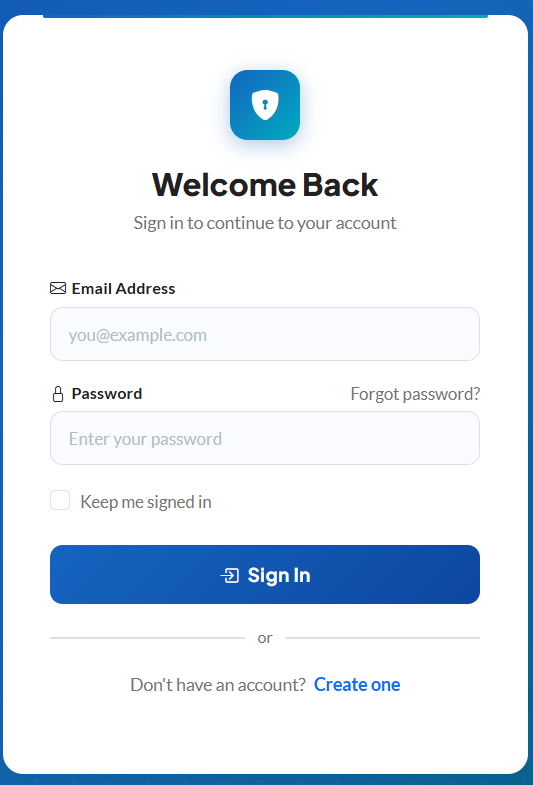
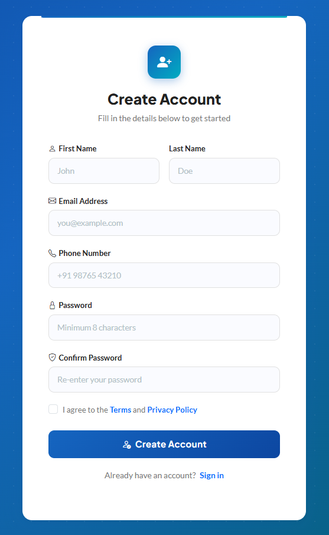
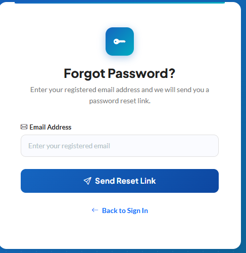
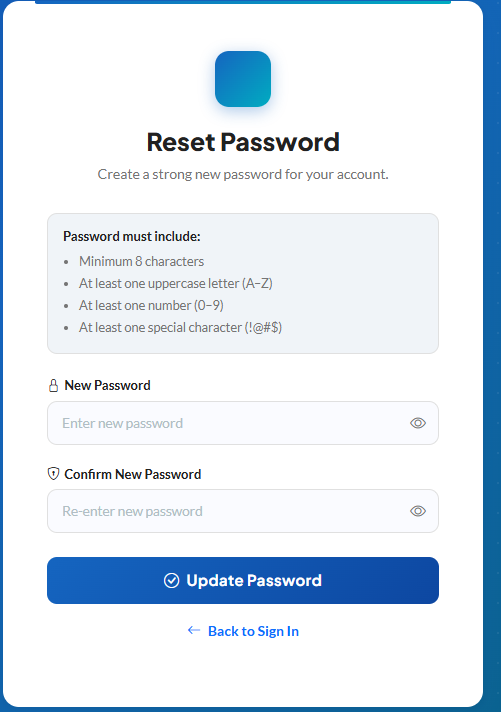
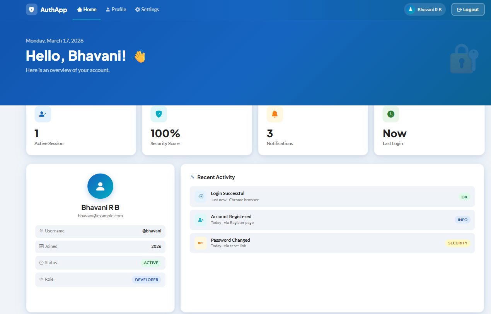

# AuthApp - Authentication System

**Assignment 2 | CampusPe | Fullstack Java Development**
**Student:** Bhavani R B
**Mentor:** Jacob Dennis

---

## 📋 Project Description

A professional, fully responsive authentication system built using Bootstrap 5 and custom CSS with Google Fonts. The system includes 5 pages with anchor tag redirections.







---

## 🗂️ Project Structure

```
html-authentication-poc/
├── login.html
├── register.html
├── forgot-password.html
├── reset-password.html
├── dashboard.html
├── styles.css
├── README.md
└── screenshots/
    ├── login.png
    ├── register.png
    ├── forgot-password.png
    ├── reset-password.png
    └── dashboard.png
```

---

## ✅ Assignment Checklist

* [x] Bootstrap 5 integrated in all HTML pages
* [x] All pages have proper Bootstrap styling
* [x] Custom CSS file created and linked
* [x] All pages are responsive
* [x] README.md complete with screenshots
* [x] Code is clean and properly indented
* [x] Repository is set to PUBLIC

---

## 🎨 Design Details

| Item              | Value               |
| ----------------- | ------------------- |
| Primary Color     | #1565C0 (Navy Blue) |
| Accent Color      | #00ACC1 (Cyan)      |
| Heading Font      | Plus Jakarta Sans   |
| Body Font         | Lato                |
| Bootstrap Version | 5.3.3               |

---

## 🔗 Page Navigation Flow

* `login.html` → `dashboard.html`
* `login.html` → `register.html`
* `login.html` → `forgot-password.html`
* `forgot-password.html` → `reset-password.html`
* `reset-password.html` → `login.html`
* `register.html` → `login.html`

---

## 👩‍💻 Author

**Bhavani R B**
CampusPe — Fullstack Java Development

🔗 GitHub: https://github.com/bhavanirb/html-authentication-poc
